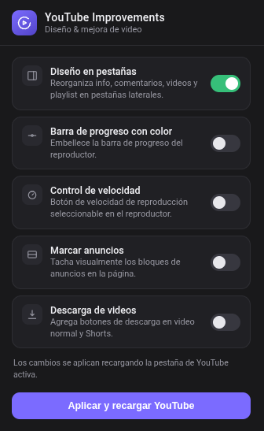

# YouTube Improvements - Layout & Video Enhancer



> [!NOTE]
> This is a Chrome Extension (Manifest V3). It runs exclusively on `youtube.com` and requires no external dependencies or build tools.

A lightweight browser extension that enhances the YouTube viewing experience with a tabbed video page layout, playback speed control, video screenshot capture, dark/light theme switching, visual ad marking, video loop, picture-in-picture, and video download -- all toggleable from the extension popup.

Version **1.1.5** | License: MIT | Author: Alexander Martinez Gonzalez

---

## Features

| Feature | Module | Description |
|---------|--------|-------------|
| Tabbed Layout | `tabview/engine.js` | Reorganizes Info, Comments, Videos, and Playlist into sidebar tabs |
| Rainbow Progress Bar | `theme-progressbar.js` | Multi-color gradient overlay on the video seek bar |
| Speed Control | `speed-control.js` | Playback speed selector (0.5x to 3x) |
| Ad Marking | `mark-or-remove-ad.js` | Visually strikes through known ad elements via CSS |
| Video Download | `toolbox.js` | Adds download button on watch page and Shorts |
| Screenshot | `screenshot.js` | Captures current video frame as a PNG image |
| Picture-in-Picture | `toolbox.js` | Browser-native PiP mode for videos |
| Video Loop | `toolbox.js` | Toggle video looping on and off |
| Dark/Light Theme | `theme.js` | Switches between YouTube themes via the PREF cookie |
| Floating Toolbar | `toolbox.js` | Gear icon overlay on the player controls with quick-access tools |
| Settings Dialog | `toolbox.js` | In-page modal to toggle all features without opening the popup |
| i18n | `language.js` | 9 supported languages (auto-detected from browser locale) |

---

## Installation

### Prerequisites

- Google Chrome (or any Chromium-based browser)

### Steps

1. Download or clone this repository:

```bash
git clone https://github.com/your-username/YouTube-Improvements.git
```

2. Open Chrome and navigate to `chrome://extensions/`.

3. Enable **Developer mode** (toggle in the top-right corner).

4. Click **Load unpacked** and select the `YouTube-Improvements/` directory.

5. The extension icon appears in the browser toolbar.

> [!WARNING]
> If you update the extension files manually, you must click the refresh icon on the extension card in `chrome://extensions/` to reload the latest code.

---

## Usage

### Basic workflow

1. Navigate to any YouTube video page (`youtube.com/watch?v=...`).

2. Click the extension icon in the Chrome toolbar. The popup displays all toggleable features.

3. Enable or disable features using the toggle switches.

4. Click **"Aplicar y recargar YouTube"** (Apply and reload YouTube) at the bottom of the popup. The active YouTube tab reloads with your settings applied.

> [!TIP]
> After the page reloads, look for the gear icon on the video player controls. Hover over it to access the floating toolbar with quick actions: settings, theme toggle, screenshot, picture-in-picture, loop, and download.

### Feature flags

All feature state is persisted in `localStorage` on the YouTube domain with the `ytie:` prefix. The popup writes changes; the content script reads them on page load.

| Storage Key | Type | Default | Purpose |
|-------------|------|---------|---------|
| `ytie:yt/functionState_01` | Object (flags) | All false | Master toggle for tabview, rainbow bar, speed control, ad marking |
| `ytie:yt/videoPlaySpeed` | Number | 1 | Saved playback speed |
| `ytie:yt/theme` | String | `"dark"` | Active theme (`"light"` or `"dark"`) |
| `ytie:yt/downloadingConfirm` | Boolean | false | First-use download redirect consent |
| `ytie:py/videoLoop` | Boolean | false | Video loop state |

---

## Architecture

```
YouTube-Improvements/
├── manifest.json                        # Chrome Extension Manifest V3
├── icons/                               # Extension icons (16, 48, 128 px)
├── popup/
│   ├── popup.html                       # Extension popup UI
│   ├── popup.css                        # Popup styles (dark theme, toggle switches)
│   └── popup.js                         # Popup logic: reads/writes localStorage on YouTube tab
    └── content/
    └── main-world/
        ├── loader.js                    # ISOLATED world injector: adds <script type="module"> for main.js
        ├── main.js                      # Entry point (MAIN world via module injection) -- orchestrates module loading
        ├── modules/
        │   ├── storage.js               # localStorage wrapper (ytie: prefix)
        │   ├── dom-utils.js             # addStyle helper
        │   ├── trusted-types.js         # Trusted Types policy passthrough
        │   ├── common-util.js           # onPageLoad, waitForElementByInterval, openInTab
        │   ├── language.js              # i18n (9 supported locales)
        │   ├── theme.js                 # Dark/light theme via PREF cookie
        │   ├── theme-progressbar.js     # Rainbow gradient progress bar
        │   ├── theme-progressbar.css.js # Base64 rainbow gradient CSS
        │   ├── speed-control.js         # Playback speed selector (0.5x-3x)
        │   ├── mark-or-remove-ad.js     # Visual ad strikethrough via CSS
        │   ├── toolbox.js               # Floating toolbar, settings, screenshot, PiP, loop, download
        │   ├── screenshot.js            # Capture video frame as PNG
        │   ├── dialog.js                # Reusable modal dialog factory
        │   └── custom-confirm.js        # Simple confirmation dialog
        └── tabview/
            ├── engine.js                # Tabview panel engine (Info, Comments, Videos, Playlist)
            └── styles.js                # Tabview CSS styles
```

### Key technical details

- **World injection**: `loader.js` runs in the ISOLATED world and injects a `<script type="module" src="chrome-extension://.../main.js">` tag into the page DOM. This causes `main.js` and all its imports to execute in the page's MAIN world context as ES modules. Chrome automatically adds the extension origin to the page's CSP, so loading extension resources via `chrome.runtime.getURL()` works without interference.
- **State**: Synchronous `localStorage` (no messaging API needed between popup and content script).
- **Dependencies**: Zero. No build tooling, no npm, no bundler. Vanilla JavaScript throughout.
- **Tabview engine** (`tabview/engine.js`, ~3500 lines) is a self-contained module adapted from [Tabview-YouTube](https://github.com/tabview-youtube/Tabview-Youtube) (MIT license).

> [!CAUTION]
> The download feature redirects to `grabshorts.com`, a third-party service. A confirmation dialog is shown on first use. No video data is sent to the extension author, but the redirect is to an external site.

---

## Development

No build step is required. Edit any `.js` or `.css` file directly, then reload the extension in `chrome://extensions/` to test changes.

### Adding a new language

1. Add the locale string map to `content/main-world/modules/language.js`.
2. The extension auto-detects `navigator.language` and falls back to English if unsupported.

### Adding a new feature toggle

1. Add a boolean flag to `ytie:yt/functionState_01` in the popup.
2. Add the corresponding toggle UI row in `popup/popup.js`.
3. Add a conditional module load in `content/main-world/main.js`.

---

## License

[MIT](./LICENSE)
